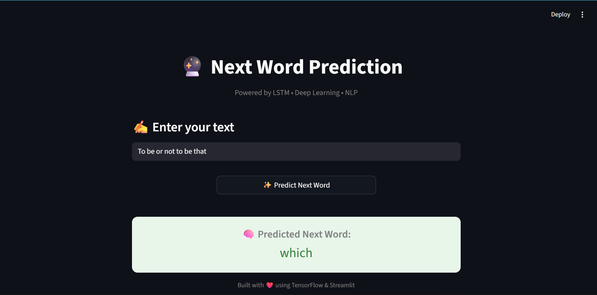

# 🔮 Next Word Prediction using LSTM

This project is a **Next Word Prediction web application** built using **Deep Learning (LSTM)** for **Natural Language Processing (NLP)**.  
Given an input text sequence, the model predicts the **most likely next word** based on learned language patterns.

The app is developed using **TensorFlow/Keras** and deployed with a clean, interactive **Streamlit UI**.

---

## 🌐 Live Demo

👉 **Live App:** https://<your-app-name>.streamlit.app  
*(Replace with your Streamlit Cloud URL)*

---

## 📸 Preview

  

---

## 💡 Features

### ✍️ Text Input
- Users can enter any sentence or phrase.
- Supports dynamic text input for real-time prediction.

### 🧠 Deep Learning Model
- Uses an **LSTM (Long Short-Term Memory)** neural network.
- Trained on text data to learn word sequences and context.
- Predicts the next most probable word.

### 🔮 Prediction Output
- Displays the predicted next word instantly.
- Clean and visually highlighted result section.

### ⚡ Optimized Performance
- Uses cached model and tokenizer loading.
- Lightweight and fast inference.

---

## 🧠 How It Works

1. User enters a text sequence.
2. Text is tokenized using a **pre-trained tokenizer**.
3. Input sequence is padded to match model input length.
4. The **LSTM model** predicts probabilities for the next word.
5. The word with the highest probability is displayed.

---

## 🛠️ Tech Stack

| Technology | Purpose |
|----------|--------|
| **Python** | Core programming language |
| **TensorFlow / Keras** | Deep Learning (LSTM model) |
| **Streamlit** | Web application framework |
| **NumPy** | Numerical operations |
| **Pickle** | Tokenizer serialization |
| **NLP** | Text sequence modeling |

---

## ⚙️ Installation & Local Setup

Follow these steps to run the project locally:

```bash
# Clone the repository
git clone https://github.com/priyan17singh/next-word-predictor.git

# Navigate to project folder
cd next-word-predictor

# Create virtual environment
python -m venv venv
source venv/bin/activate      # Linux/Mac
venv\Scripts\activate         # Windows

# Install dependencies
pip install -r requirements.txt

# Run the Streamlit app
streamlit run app.py

```

---

## 👨‍💻 Author

**Priyanshu Singh**  
GitHub:  [@priyan17singh](https://github.com/priyan17singh)

---

## ❤️ Support

**If you like this project, don’t forget to give it a ⭐ on GitHub and share a cup of chai ☕ with the creator!**

*“Language is a pattern — deep learning learns to predict it.”*